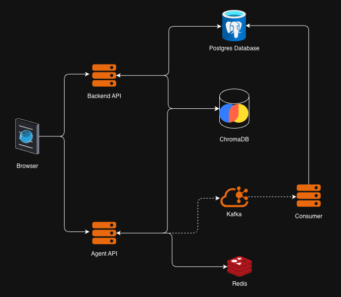
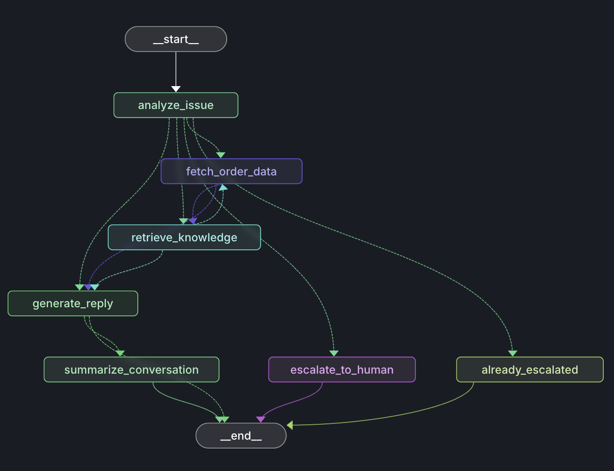
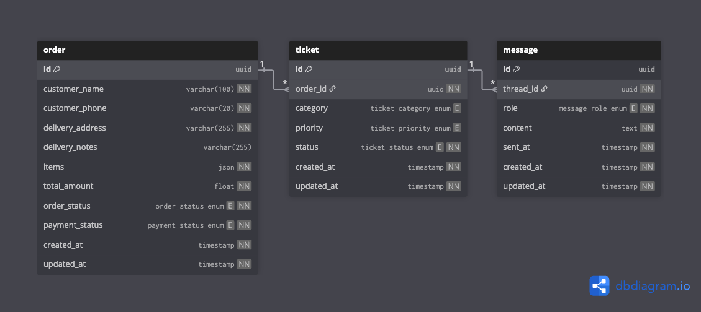

# SupportPilot

SupportPilot is an AI-powered support platform designed to streamline customer service operations for an app-based food delivery system. It enables support agents and automated AI assistants to efficiently manage customer interactions, resolve issues, and access operational data from a single interface.

The platform integrates ticket management, order tracking, and AI-driven assistance to help support teams quickly diagnose problems, respond to customers, and maintain a high level of service quality.

## Demo

Click on the thumnail below to open on YouTube

[](https://www.youtube.com/watch?v=sxqn_8Hy95A)
<!-- Generated by https://t.cuts.so/github/video -->

## Features

- **Order Management:** Create, view, and manage customer orders within the system, including order details and status.

- **Ticket Management:** Create and manage support tickets linked to customer issues, orders, or delivery problems.

- **AI Assistant Chat:** Interact with an AI-powered assistant that can access ticket and order context to help diagnose issues and suggest resolutions.

- **Automated Ticket Analysis:** The AI agent automatically analyzes incoming tickets to determine their category and priority, helping streamline support workflows.

- **Human Agent Escalation:** Escalate complex or unresolved issues to a human support agent and continue the conversation seamlessly.

## Usage

### Docker

```sh
cd docker
docker compose up
```

### Applications

- Agent

```sh
cd agent

# venv
python3 -m venv env
source env/bin/activate
pip install -r requirements.txt

# create .env based on .env.example

# run
python3 app.py
```

- Backend and consumer

```sh
cd backend

# venv
python3 -m venv env
source env/bin/activate
pip install -r requirements.txt

# create .env based on .env.example

# run
python3 app.py
python3 consumer_app.py
```

- Frontend

```sh
cd frontend/admin

# dependencies
npm i

# run
npm run dev
```

## Technology Stack



### Backend API

Written in FastAPI, this service acts as the main backend API powering the SupportPilot system.

- **Orders:** Create, list, update, and delete orders. Orders are the base entities in the system. They represent customer purchases in an app-based food delivery system, where users can create orders and add food items. These orders serve as the primary reference for support interactions and ticket creation.

- **Tickets:** Create, list, update, and delete tickets. Support tickets can be created for specific orders when users encounter issues such as delivery delays, incorrect items, or payment problems. The AI agent automatically assigns the ticket category and priority, helping streamline support workflows and triage.

- **Documents:** Create, list, update, and delete documents. Documents can be managed through the API and are used as a knowledge base for the AI agent. After ingestion, documents are converted into embeddings using BAAI/bge-small-en-v1.5 and stored in a ChromaDB vector database. The AI agent retrieves relevant information from these documents using Retrieval-Augmented Generation (RAG).

- **Human Agent Chat (WebSockets):** Once a ticket is escalated by the AI agent, users can chat with a human support agent in real time using WebSockets. This enables seamless handoff from automated support to human assistance when necessary.

### Agent API

- **LangGraph-based Agent:** The AI agent is built using LangGraph, enabling structured, stateful workflows for handling ticket analysis, order queries, knowledge retrieval, and response generation.

- **Streaming Responses API:** A FastAPI streaming endpoint is implemented to stream the agent’s responses in real time, allowing clients to receive partial outputs as they are generated.

- **Kafka Event Production:** The agent publishes messages and ticket classification events (category and priority) to a Kafka topic, enabling downstream services to consume and react to these events asynchronously.

### Agent Workflow

The AI agent is implemented as a **LangGraph workflow**, where each node represents a specific step in the support handling process. The agent analyzes the user’s issue, gathers relevant data, retrieves knowledge, and decides whether it can resolve the issue or escalate it to a human agent.



#### Flow Overview

1. **`__start__`**: Entry point of the workflow when a user message is received.

2. **`analyze_issue`**: The agent analyzes the user message and ticket context to understand the problem.
   - Determines the nature of the issue
   - Identifies signals for **ticket category and priority**

3. **`fetch_order_data`**: If the issue relates to an order, the agent retrieves relevant **order details** from the backend system to provide context for troubleshooting.

4. **`retrieve_knowledge`**: The agent queries the **vector knowledge base (ChromaDB)** using RAG to retrieve relevant documentation or support guidelines that may help resolve the issue.

5. **`generate_reply`**: Using the gathered context (conversation history, order data, and retrieved knowledge), the agent generates a response for the user.

6. **`summarize_conversation`**: The agent creates a concise summary of the interaction for logging and future reference before ending the workflow.

7. **`escalate_to_human`**: If the agent determines that the issue cannot be resolved automatically, it escalates the ticket to a **human support agent**.

8. **`already_escalated`**: If the ticket has already been escalated previously, the agent avoids redundant escalation and routes the flow accordingly.

9. **`__end__`**: Marks the completion of the workflow.

#### Key Behavior

- The agent dynamically decides whether to:
  - Fetch **order data**
  - Retrieve **knowledge base information**
  - **Respond automatically** to the user
  - **Escalate the issue** to a human agent

- Multiple paths can lead to **reply generation or escalation**, depending on the context and confidence of the AI agent.

### Redis — Agent Memory

Redis is used as the short-term memory store for the AI agent. It maintains the conversational state and intermediate context required by the LangGraph workflow.

- Stores conversation history and contextual messages for ongoing interactions
- Enables stateful agent behavior across multiple turns in a conversation
- Provides low-latency access to context during agent execution
- Allows the agent to maintain memory without repeatedly querying the primary database

This ensures the agent can respond with full awareness of the ongoing conversation while keeping the workflow fast and efficient.

### PostgreSQL — Core Application Database



PostgreSQL serves as the primary relational database for the system.

It stores all structured application data, including:

- Orders – customer orders and associated food items
- Tickets – support tickets linked to orders along with metdata of category, priority, and escalation status
- Messages – conversation history between users, AI agents, and human agents

PostgreSQL provides reliable transactional storage and acts as the source of truth for operational data within the SupportPilot platform.

### ChromaDB — Vector Knowledge Store

ChromaDB is used as the vector database for storing embedded documents that form the agent’s knowledge base.

- Documents are converted into embeddings using BAAI/bge-small-en-v1.5
- The embeddings are stored in ChromaDB for efficient similarity search
- During conversations, the agent retrieves relevant information using Retrieval-Augmented Generation (RAG)

This allows the AI agent to access supporting documentation, policies, and troubleshooting guides to produce more accurate and context-aware responses.

### Kafka — Event Streaming

Kafka is used as the event streaming system to decouple agent processing from data persistence.

The agent publishes events such as:

- User and agent messages
- Ticket category classification
- Ticket priority detection

These events are consumed by downstream services that:

- Persist messages to the database
- Update ticket metadata
- Maintain system state asynchronously

Using Kafka enables scalable, event-driven processing, allowing the agent to operate independently while other services handle storage and updates.

### Phoenix — Agent Tracing & Observability

Phoenix is used to provide tracing and observability for the AI agent workflows. It captures detailed traces of the LangGraph execution, making it easier to monitor, debug, and analyze agent behavior.

- Tracks end-to-end execution of agent workflows
- Records node-level traces for each step in the LangGraph pipeline
- Captures LLM calls, tool usage, and retrieval operations
- Enables inspection of inputs, outputs, and intermediate states
- Helps diagnose issues in agent reasoning and decision-making

By integrating Phoenix, developers can gain visibility into how the agent processes requests, retrieves knowledge, and generates responses, which is especially useful for debugging and improving the agent during development and experimentation.

### Frontend — React (Vite + TypeScript)

The frontend is built using React with Vite and TypeScript, providing a fast development environment and a strongly typed codebase.

- Vite is used as the build tool and development server, enabling fast hot module replacement and efficient builds.
- TypeScript provides type safety and improved developer experience for building scalable frontend components.
- The UI is built using AWS Cloudscape Components, a design system that provides pre-built, accessible components for building modern web applications.

The frontend provides interfaces for:

- Order Management – creating and viewing customer orders
- Ticket Management – creating and tracking support tickets
- Chat Interface – interacting with the AI agent
- Human Agent Chat – real-time messaging when tickets are escalated
- Statistics Dashboard – Statistics for tickets and orders

Cloudscape components ensure a consistent UI/UX, while React handles the dynamic interaction between users, the AI agent, and backend services.
